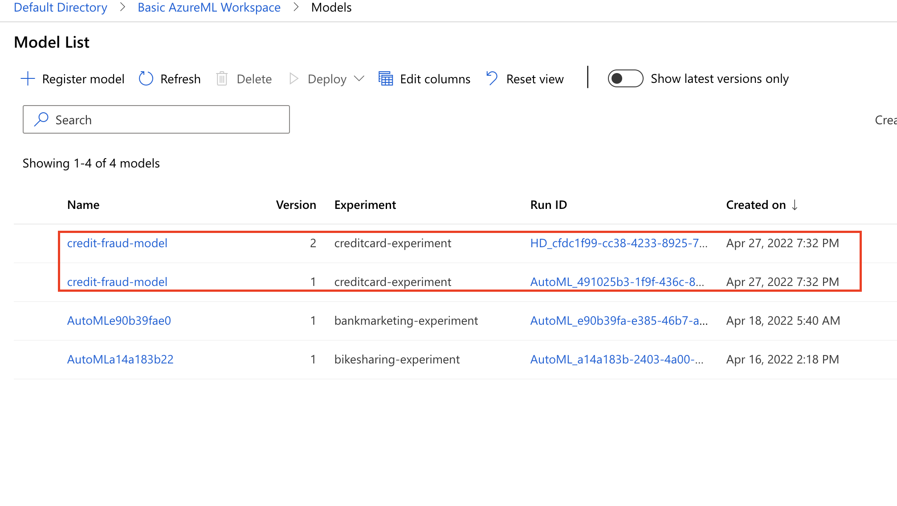

# Project Capstone - Credit Card Fraud Detection

In this Capstone Project, we create a model that detect fraudulent transaction using Dataset from Kaggle. The project leverage Azure Machine Learning capabilities by using **Automated ML** (AutoML) and **HyperDrive** to find the best model for this classification task. AutoML helps to kickstart the experiment by training tens to hundreds of models and find the best algorithm with the best preprocessing steps and hyperparameters. We then compare this to HyperDrive, a hyperparameter tuning engine from Azure to find the best hyperparameter from a specific learning algorithm. The best model from these two approaches was deployed as a webservice endpoint, that can be accessed externally via HTTP requests.

## Project Set Up and Installation

An Azure Machine Learning _active subscription_ is needed for this, then create the followings:

1. Download azure CLI.

First this will be used to interact with most of Azure services, but in this case we use it to create a **Service Principal**.

For more details of installing to specific OS (Windows, Linux, MacOS), follow this documentation from Azure [install-azure-cli](https://docs.microsoft.com/en-us/cli/azure/install-azure-cli)

2. Create Azure ML Workspace.

In Azure Cloud, look for Azure Machine Learning and choose create. We will then specify the `subscription_id`, create a new Resource Group and also choose the Region.

3. Configure the Service Principal.

After the Azure ML Workspace is created, we move to the Azure CLI and do

```sh
$ az login
```

to login to your Azure Cloud subscription

then create and assigned role to Service Principal for Azure ML Workspace, this is so authentication can be done automatically

```sh
$ az ad sp create-for-rbac --sdk-auth --name ml-auth
```

we can show the id has been created by checking the `clientId` created from the above command

```sh
$ az ad sp show --id <yourClientId>
```

then we execute this command instead, since v2 of azure ml cli is used

```sh
az role assignment create --assignee <objectId> --role "Owner" --scope "/<subscriptionId>/resourceGroups/<yourresourceName>/providers/Microsoft.MachineLearningServices/workspaces/<yourWorkspace>"
```

4. Create a new Compute Instance

Lastly, we want to interact and create runs or pipelines using Azure ML SDK available out of the box from JupyterLab of Compute Instance. Create a new _CPU_ Compute Instace with `Standard_DS3_v2` specification (**recommended**), although a much smaller or much bigger specification can also be used.

## Dataset

### Overview

We will be using [**Kaggle Dataset - Credit Card Fraud Detection**](https://www.kaggle.com/datasets/mlg-ulb/creditcardfraud). This dataset consist of 285k rows transaction of credit card, amongst which a fraction of them (about **1%**) are fraudulen transactions (highly imbalanced). The columns are V1, V2 ... V28, amount. time, Class, all of which resuled from PCA transformations with no null values. The target, as we expected is the Class consist of 0 or 1.

### Task

The task is simply to find amongst these many transaction which are fraudulent trnsactions. Since there are only two classes we can consider this as **Binary Classification** task. The features, except **amount** and **time** are uninterpretable, possibly because of confidentiality. All the values of these columns are numerical and scaled.

### Access

The data can be registered using the public github URL, since it's already downloaded and put it on my personal github account, the link is [here](https://media.githubusercontent.com/media/satriawadhipurusa/ml-dataset-collection/master/Fraud-Detection/creditcard-fraud.csv).

Using this link and Azure ML SDK, we are able to register it or just accessed it anywhere - as long as you have the right credentials for the Azure ML Workspace. First the dataset is registered in Azure Dataset as `creditcard-dataset`. It also accessed inside `train.py` training script for HyperDrive later on.


## Automated ML

- **Compute**
  We are using a Compute Cluster consist of four nodes, each which is using `STANDARD_D2_v3` as it's specification.

- **AutoML Config**
  - Primary metric: **`AUC_Weighted`** (for imbalanced dataset)
  - Experiment exit score: 0.98
  - Experiment timeout: 30 minutes
  - Early stopping enabled - either reach the timeout or pass the exit score

The task is `Classification`, and since we are using four nodes we can set the `max_concurrent_iterations` to four as well for faster training.

### Results

_TODO_: What are the results you got with your automated ML model? What were the parameters of the model? How could you have improved it?

There are a couple of **models**, **hyperparameter** and **preprocessing** steps combination from this AutoML runs. The worst model is a combination between **PCA** and **LightGBM**, and the best one is a combination between **StandardScalerWrapper** and **LightGBM**.

The best model achieve the **AUC Weighted** score of **0.97** with the hyperparameters of the following:

```text
boosting_type: gbdt,
colsample_bytree: 0.1,
learning_rate: 0.07894947368421053,
max_bin: 260,
max_depth: 5,
min_child_weight: 6,
min_data_in_leaf: 0.003457931034482759,
min_split_gain: 0.21052631578947367,
n_estimators: 200,
num_leaves: 131,
reg_alpha: 0.7894736842105263,
reg_lambda: 0.3684210526315789,
subsample: 0.3468421052631579
```

We can **improve** this either by engineered more features, clean the data (if there are unclear patterns) or choose a more complex model such as Neural Networks like Auto Encoder that excels in looking for anomalies.

**Run Details:**


**Best Model:**


**Best Model in Azure ML Studio:**


## Hyperparameter Tuning

For the hyperparameter, we would like to optimize a `SupportVectorClassifier` model from scikit-learn or **SVC**.This model is usually good with separating anomalies from the rest of the data and is simple enough. It also has `class_weight` to correctly handles imbalanced dataset.

Parameters to be tuned are:

- Regularization parameter (C) - used to prevent overfitting - `float` ranges from 0.01 to 100
- Kernel parameter (gamma) - used to find the best kernel that suites the data (linear/nonlinear) - `float` ranges from 0.01 to 100
- Class Weight - balance the class frequency by assigning weight - `string`, one of `{0: 0.05, 1: 0.95}`, `{0: 0.1, 1: 0.9}`, `{0: 0.25, 1: 0.75}`

Since these ranges are quite large with limited resources, we would like to use `BayesianParameterSampling` with no termination policy, and the goal is to also maximize **`AUC_Weighted`**

### Results

The best run from this HyperDrive runs achieve the **AUC Weighted** of **0.919**, the hyperparameters that are tuned to achieve this are:

```text
gamma: 0.275
C: 44.808
class_weight: {0: 0.25, 1: 0.75}
```

We can improved this by also hypertune the preprocesing steps and also try more complex models. Similarly, we could also engineered more features or clean the data to make the patterns clearer for the learning algorithn.

**Run Details:**


**Best Model:**


**Best Model in Azure ML Studio:**


## Model Deployment

Before deployment, first we need to register both models from HyperDrive and Automated ML using python SDK. Since these models are essentially performing the same task and originated from the same dataset, it make sense to name them the same which is **credit-fraud-model**.

In MLOps and Azure specifically, we can differentiate both models using their versions. The first version is the Automated ML model, since it was run the first time, while the second version is the HyperDrive Model.

**Registered Model:**


After comparison and we should already have knew it from the training runs, Automated ML still has the highest metric in **AUC Weighted** compared to HyperDrive. This is due much broader ranges of combinations the AUtomated ML can do compared to the narrow search space of HyperDrive. A more knowledge-able decision of choose the hyperparameter and model for HyperDrive is needed to match the performance of Automated ML.

**Automated ML Metric**


**HyperDrive ML Metrics**


The model then deployed using the python SDK as well and the following configs:

- Azure Container Services
  - Core: 1
  - Memory: 1
  - Auth Enabled
- Environment (downloaded)
  - Python: 3.7.9
  - azureml-train-automl-runtime==1.40.0.post1
  - inference-schema
  - azureml-interpret==1.40.0
  - azureml-defaults==1.40.0
  - numpy==1.18.5
  - pandas==1.1.5
  - scikit-learn==0.22.1
  - py-xgboost==1.3.3
  - fbprophet==0.7.1
  - holidays==0.10.3
  - psutil==5.7.2

`InferenceConfig` then can be instantiated using this conda environment and downloaded `score.py` of V2 payload. The model are then deployed to Azure Container Services (ACI) as a webservice with key-based authentication enabled. We also enabled Application Insights for monitoring purposes.

**Deployed Model in Azure ML Studio**


To query the model, we can use python `requests` library or Postman, assuming we have the scoring URI and it's primary key or JWT Token.

Use this sample input as json

```json
{
  "Inputs": {
    "data": [
      {
        "Time": 44103.0,
        "V1": -0.693040594680932,
        "V2": 0.764389223964741,
        "V3": 1.99805631593662,
        "V4": 0.100376852695017,
        "V5": -1.1372460017648,
        "V6": -0.365348673979816,
        "V7": -0.433140471391932,
        "V8": 0.577989152367118,
        "V9": 0.0608469253975611,
        "V10": -0.738222721668695,
        "V11": -0.842300495358172,
        "V12": -0.188007348547743,
        "V13": -0.101489061861503,
        "V14": 0.0929121137405934,
        "V15": 1.31393759823724,
        "V16": 0.861394039843105,
        "V17": -0.511023192743688,
        "V18": 0.703958734629345,
        "V19": -0.463798354997935,
        "V20": -0.126354454184353,
        "V21": 0.397569438800442,
        "V22": 1.00847401543129,
        "V23": -0.0104368577150254,
        "V24": 0.410138044505595,
        "V25": -0.668195095461561,
        "V26": 0.361615934763707,
        "V27": 0.034253171439257,
        "V28": 0.112027801999386,
        "Amount": 23.6
      },
      {
        "Time": 53937.0,
        "V1": -2.04260819938332,
        "V2": 1.57357807373238,
        "V3": -2.37265243271278,
        "V4": -0.572676430720841,
        "V5": -2.09735276458226,
        "V6": -0.174142123011242,
        "V7": -3.03951978687359,
        "V8": -1.63423295064356,
        "V9": -0.594808638750073,
        "V10": -5.45960189444545,
        "V11": 2.37853722491518,
        "V12": -2.33027064686235,
        "V13": -0.24623272486659,
        "V14": -4.05852343611281,
        "V15": -0.316983146603949,
        "V16": -2.52266081131673,
        "V17": -5.60340034818128,
        "V18": -0.778439963776289,
        "V19": 0.860211793588662,
        "V20": 0.825565985313424,
        "V21": -0.723326195587733,
        "V22": 0.501221637302624,
        "V23": -0.696892260580304,
        "V24": -0.600513726439022,
        "V25": 0.127547028812739,
        "V26": -0.786072220292301,
        "V27": 0.606097322391548,
        "V28": 0.171696507911815,
        "Amount": 261.87
      }
    ]
  },
  "GlobalParameters": {
    "method": "predict"
  }
}
```

Then send it to the endpoint according which client we will be using, in Python:


The same can be done using **CURL** or **Postman**, then we can confirm the logs is outputed from the stdout of ACI


## Future Improvement

For future improvement, there are a couple of things to try:

- Integrate Feature Store (Feast) as to minimize train-serve skew
- Package the whole step by step as Azure ML Pipeline for scheduled event-driven training run
- Set up monitoring to detect data drift
- Set up model explainability in HyperDrive so we can also compare from the explainability of Automated ML

## Screen Recording

To access the full screen recording visit the youtube link: [Udacity - Azure MLND - Project Capstone](https://www.youtube.com/watch?v=4OksxpBcULw)
