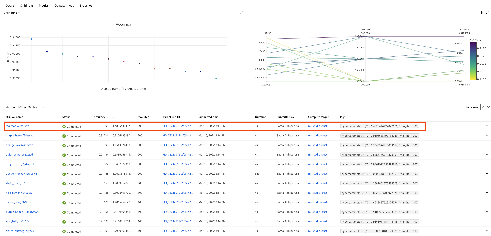
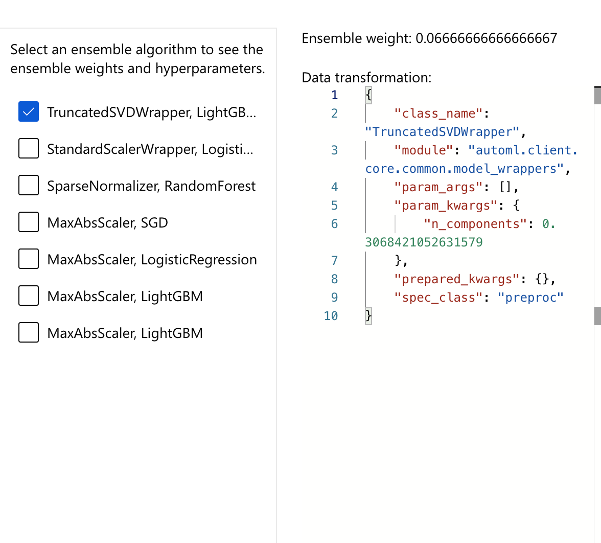
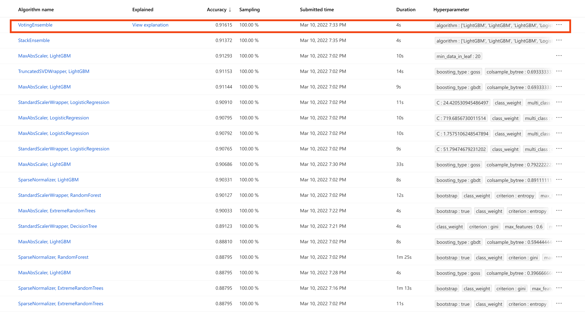
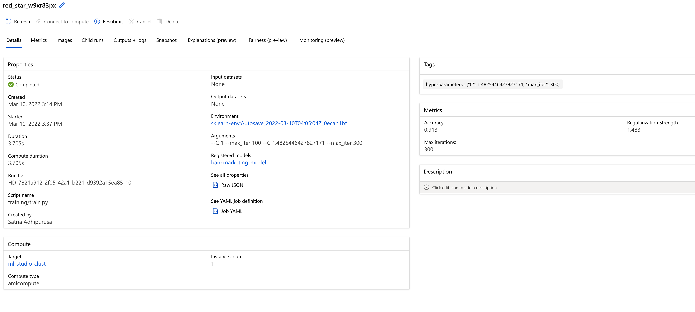
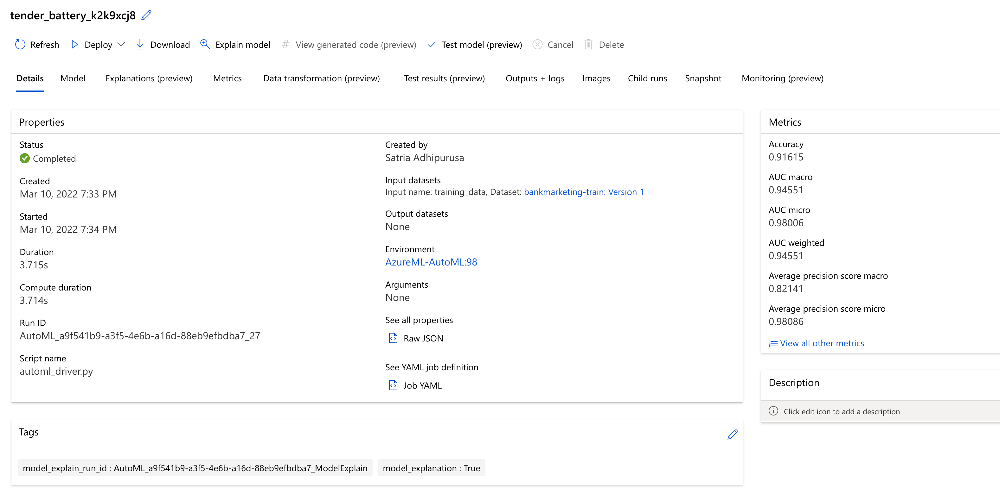
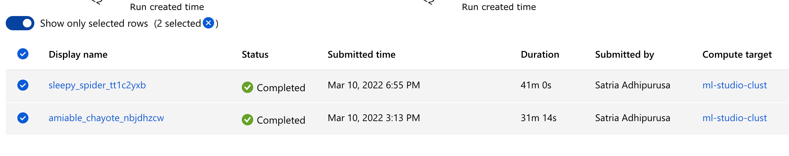
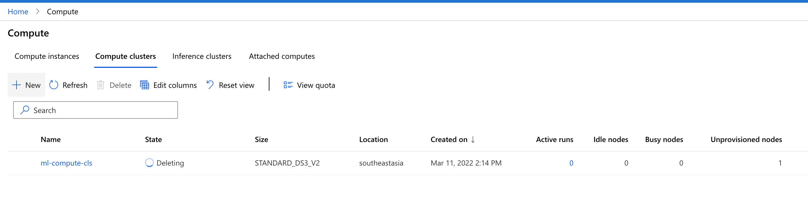

# Optimizing an ML Pipeline in Azure

## Overview

This project is part of the Udacity Azure ML Nanodegree.
In this project, we build and optimize an Azure ML pipeline using the Python SDK and a provided Scikit-learn model.
This model is then compared to an Azure AutoML run.

## Useful Resources

- [ScriptRunConfig Class](https://docs.microsoft.com/en-us/python/api/azureml-core/azureml.core.scriptrunconfig?view=azure-ml-py)
- [Configure and submit training runs](https://docs.microsoft.com/en-us/azure/machine-learning/how-to-set-up-training-targets)
- [HyperDriveConfig Class](https://docs.microsoft.com/en-us/python/api/azureml-train-core/azureml.train.hyperdrive.hyperdriveconfig?view=azure-ml-py)
- [How to tune hyperparamters](https://docs.microsoft.com/en-us/azure/machine-learning/how-to-tune-hyperparameters)

## Summary

In this project we aim to predict customer intent to subscribe a term deposit of bank (**binary classification**), after the campaign has been launched. We consider features such as age, jobs, marital, and their education levels. The complete data set can be accessed in UCI Machine Learning Repository [here](https://archive.ics.uci.edu/ml/datasets/bank+marketing) and related to Portuguese Bank Institution.

The project was divided into two parts:

1. Train a Logistic regression and use _HyperDrive_ for hyperparameter tuning
2. Train and _AutoML_ and find the best models

Both of which we aim to maximize the _accuracy_ of the classification task. The best performing model is from AutoML using **VotingEnsemble** algorithm with _accuracy_ score of **0.916** (91.6%) and _AUC_ of **0.945** (94.5%).

## Scikit-learn Pipeline

Most of the loading and preprocessing are done in `train.py`, then the HyperDrive execution is using notebook `udacity-project.ipynb` from Azure ML Studio compute instance.

The pipeline steps are as follows:

1. Load data using `TabularDataset`
1. Data preprocessing including one hot encoding, feature selection and feature engineering, and divide data into features and label
1. Splitting the dataset into train and test set
1. Using scikit-learn **LogisticRegression** to fit the model and log the "Accuracy"

This training script are then passed into `HyperDrive` as follows:

1. Determine parameter sampling strategy using `RandomParameterSampling`
1. Pick a termination policy using `BanditPolicy`
1. Decide primary metric name and goal e.g. to maximize accuracy
1. Specify environment and resources to compute
1. Setup running config and arguments by using the previous training script file

Package the above configurations into `HyperDriveConfig` and submit the run, then we monitor the progress. Once they're done, we save or register the best model into Azure ML Studio.

### Parameter Sampling Strategy

Parameter sampling using `RandomParameterSampling` always perform as good if not better than Grid, since Random will sample at a continous space compared to discrete space in Grid. This thus allows to find the best hyperparameter a lot faster and more fine-tuned.

Bayesian on the other hand takes the longest and usually are heavy in computation. Since it requires to sample the parameter every now and then before it decide to fine-tuned the search space further (explore vs exploit).

### Early Stopping Policy

Early termination using Bandit can help to determine whether the best performing run are within specified slack factor/slack amount, if not then those runs will be terminated. The policy will sample at each slack interval provided by the user.

Compare to other policies, which will look at worst performing runs (Truncation Policy) or runs against a median (Median Policy), Bandit will always compared to the best run and this benefit us since we want the best hyperparameter

## AutoML

The AutoML pipeline are very straightforward and only required the dataset without the need of custom ML model to optimize.

The pipeline steps are as follows:

1. Load data using `TabularDataset`
1. Data preprocessing including one hot encoding, feature selection and feature engineering, and divide data into features and label
1. Specify the configuration such as:
1. Task (Classification or Regression)
1. Primary Metric
1. Label Column
1. Resource to compute

From the result, we see that the **VotingEnsemble** output the best accuracy. Since this is an ensemble method, it consist the following combination of models and transformations:

**Models**

- Light Gradient Boosting
- Logistic Regression
- Random Forest
- Stochastic Gradient Descent

**Transformation**

- Truncated Singular Value Decomposition
- Standard Scaler
- Sparse Normalizer
- Max Abs Scaler

There are other transformations and models combination or 29 models in total.

## Pipeline comparison

Performance in terms of ML metrics, the AutoML only slighty higher than HyperDrive or optimized Logistic Regression, which is **0.916** compared to **0.913** respectively. So the difference are not that significant.

In terms of computation time or duration to train the models, both of them took **41 minutes** compared to **30 minutes** between AutoML vs HyperDrive respectively. If we see from the logs of runs between both of the pipeline, HyperDrive also reach 0.91 accuracy at first run, while AutoML took sometime to reach 0.91.

This could indicate that for us human to know the data and the inherent limitations of each algorithm and what best suited for a particular task or use case is more useful. And we can reach even a higher accuracy than using AutoML. But these needs us to invest in time to carefully crafted the features or the data wrangling, which we may not always have. AutoML can solve this and serves as a **baseline**, since all we need are computing power and we can get a decent model very **quickly**.

**Compare the two models and their performance. What are the differences in accuracy? In architecture? If there was a difference, why do you think there was one?**

## Future work

**What are some areas of improvement for future experiments? Why might these improvements help the model?**

- Try using Deep Learning and Neural Achitecture Search (NAS) as this will make the models to find more non-linear patterns
- Using distributed GPU cluster for faster training by distributing the data or the model architecture
- Use a known pipeline framework such as Scikit-Learn Pipeline, TensorFlow Extended, or Feature Stores to prevent training-serving skew

## Proof of cluster clean up

The project was done using personal Azure Cloud account, and the compute cluster has been cleaned-up

